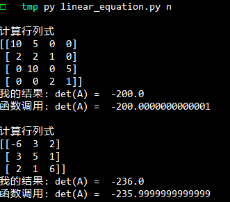

**<span style="float:right">PB16030899-朱河勤 <br>2018-5-20<span>**


# <center> 高斯列主元消元法计算行列式
>书上p186, 附录1程序11

# 算法描述
行序从1到m,当为第i行, 找出第i列第i个数到第m个数中最大值的行k,然后交换行i,k, 然后依次用第i行,将i+1..m行的第i个元素化作0, 最后得到上三角矩阵, 对角线元素相乘就得到行列式

# 程序源码
```python
import numpy as np
def gauss_prior_elimination(A,b=None):
    '''using guass elimination,get up_trianglge form of A'''
    m,n = A.shape
    res = [0]*m if b is None else b
    if m!=n:raise Exception("[Error]: matrix is not inversable")
    # necessary,otherwise when the dtype of A is int, then it will be wrong
    B = np.matrix(A,dtype=float) 
    for  i in range(m-1):
        col = abs(B[i:,i]) #  note using abs value,  return a matrix in (m-i)x1 form
        mx = col.max()
        if mx==0: raise Exception("[Error]: matrix is not inversable")
        pos = i+col.argmax()
        if pos != i :  B[[pos,i],:] = B[[i,pos],:]  #  note how to swap cols/rows
        #B[i,:] = B[i,:]/mx
        #res[i]/=mx
        for j in range(i+1,m):
            if B[j,i]!=0:
                B[j,:] -= B[j,i]/B[i,i] * B[i,:]
                res[j] -= res[i]/B[i,i]*res[j]
    if b is None:return B
    return B,res

def det(A):
    m,n = A.shape
    ret=1
    B = gauss_prior_elimination(A)
    print(B)
    for i in range(m):ret *= B[i,i]
    return ret
```

# 测试结果

