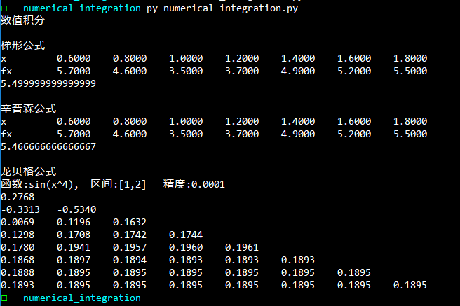

**<span style="float:right">PB16030899-朱河勤 <br>2018-5-20<span>**


# <center> 数值积分

# 算法描述
分别用了梯形计算公式 , 辛普森计算公式, 龙贝格计算公式在复化形式(避免龙格现象的出现)

计算积分的值

第一个例子是[0.6,1.8], 区间间隔为0.2,函数值给出,用了梯形与辛普森去求数值积分,
是书上p137习题6

第二个例子是求 $\int_{1}^{2}  sin(x^4)dx$  (我自己举的例子)
利用了龙贝格数值积分公式来求


# 测试结果



# 程序源码
```python

from math import sin

import numpy as np

def mypprint(lst):
    for i in lst:
        print(('%.4f'%i).ljust(10),end='')
    print()

def trapezoidal(a,b,h,fs):
    '''梯形积分公式'''
    xs = [i for i in np.arange(a,b+h,h)]
    print('x'.ljust(10),end='')
    mypprint(xs)
    print('fx'.ljust(10),end='')
    mypprint(fs)
    ret = h*(sum(fs)-fs[0]/2 - fs[-1]/2)
    print(ret)
    return ret


def simpson(a,b,h,fs):
    '''辛普森积分公式'''
    xs = [i for i in np.arange(a,b+h,h)]
    print('x'.ljust(10),end='')
    mypprint(xs)
    print('fx'.ljust(10),end='')
    mypprint(fs)
    ret = h/3*(4* sum(fs[1::2])+ 2*sum(fs[2:-1:2]) + fs[0]+fs[-1])
    print(ret)
    return ret


def romberg(a,b,f,epcilon):
    '''romberg(龙贝格) 数值积分'''
    h = b-a
    lst1=[h*(f(a)+f(b))/2]
    mypprint(lst1)
    delta = epcilon
    k=1
    while delta >= epcilon:
        h/=2
        k+=1
        lst2=[]
        lst2.append((lst1[0]+h*2*sum(f(a+(2*i-1)*h) for i in range(1,2**(k-2)+1)))/2)
        for j in range(0,k-1):
            lst2.append(lst2[j]+(lst2[j]-lst1[j])/(4**(j+1)-1))
        delta = abs(lst2[-1]-lst1[-1])
        lst1=lst2
        mypprint(lst1)

if __name__=='__main__':
    print("数值积分")
    a,b,h = 0.6,1.8,0.2
    fs=[5.7,4.6,3.5,3.7,4.9,5.2,5.5]
    print("\n梯形公式")
    trapezoidal(a,b,h,fs)

    print("\n辛普森公式")
    simpson(a,b,h,fs)

    print('\n龙贝格公式')
    print("函数:{},  区间:{}   精度:{}".format('sin(x^4)','[1,2]',1e-4))
    romberg(1,2,lambda x:sin(x**4),1e-4)


```
