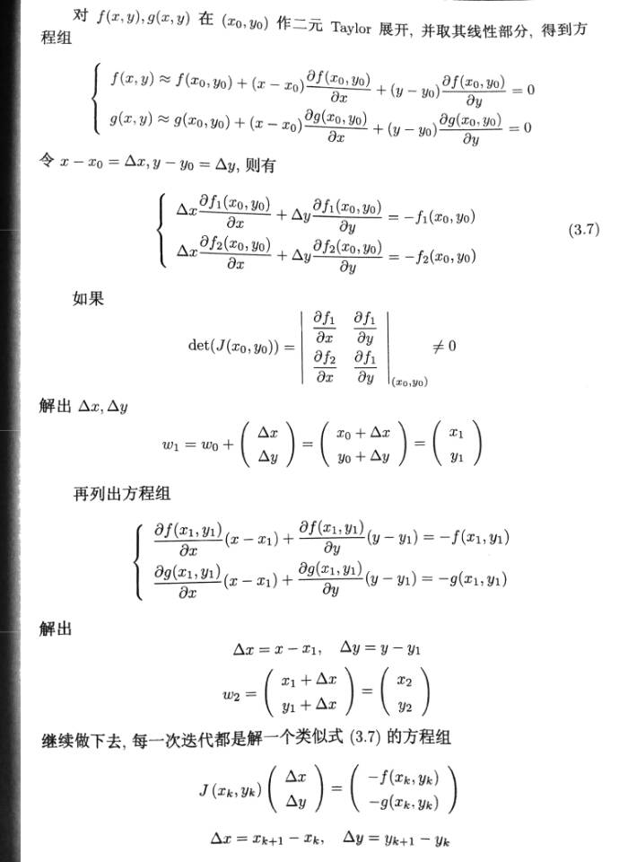
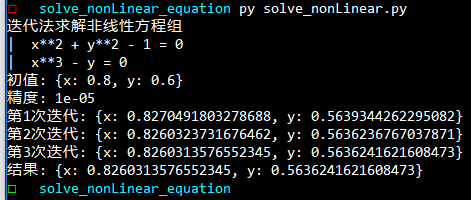

**<span style="float:right">PB16030899-朱河勤 <br>2018-5-20<span>**


# <center> 牛顿迭代解非线性方程组
>书上p186, 附录1程序10

# 程序源码
```python

import sympy
import numpy as np
from math import sqrt

def solveNonlinearEquations(funcs:[sympy.core],init_dic:dict,epsilon:float=0.001,maxtime:int=50)->dict:
    '''solve  nonlinear equations:'''
    li = list(init_dic.keys())
    delta = {i:0 for i in li}
    ct = 0
    while 1:
        ct+=1
        ys = np.array([f.subs(init_dic) for f in funcs],dtype = 'float')
        mat = np.matrix([[i.diff(x).subs(init_dic) for x in li] for i in funcs ],dtype = 'float')
        delt = np.linalg.solve(mat,-ys)
        for i,j in enumerate(delt):
            init_dic[li[i]] +=j
            delta[li[i]] = j
        print("第{}次迭代: {}".format(ct,init_dic))
        if ct>maxtime:
            print("after iteration for {} times, I still havn't reach the accurrency.\
                    Maybe this function havsn't zeropoint\n".format(ct))
            return init_dic
        if sqrt(sum(i**2 for i in delta.values()))<epsilon:return init_dic

if __name__ == '__main__':
    x,y = sympy.symbols('x y')
    funcs=[x**2+y**2-1,x**3-y]
    init = {x:0.8,y:0.6}
    epsilon = 1e-5
    print("迭代法求解非线性方程组")
    for i in funcs:
        print('| ',i, '= 0')
    print("初值: {}".format(init))
    print("精度: {}".format(epsilon))
    res = solveNonlinearEquations(funcs,init,epsilon)
    print("结果: {}".format(res))

```
# 算法描述


直到 delta x, delta y 的绝对值小于epsilon

# 测试结果

