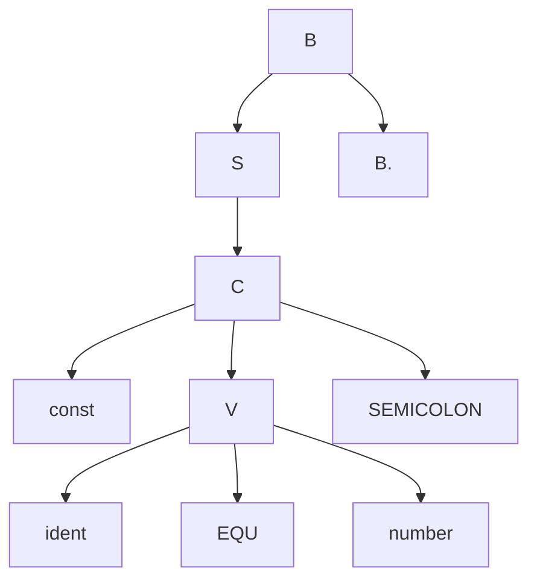

# Lab 2 Syntax Analysis

## 1 Goal
1. 理解pl0语言的语法图
2. 使用递归下降的方式测试语法的正确性
3. 产生语法树
4. 合理的错误检测

## 2 Contents
### 2.1 理解语法图
具体内容参照 pl0语言语法图.pdf
### 2.2 递归下降分析
在syntax/目录下已经实现一部分代码，包括
```
1. 符号表的定义以及操作（其中level在pl0_lex.h中定义，即`修改了lex中的文件`）
2. 程序体中const变量的定义声明的分析方式（观察语法图，很容易理解流程）
3. 其它函数的名称，以便自行填充
4. 修改了test.c文件，可做一定的测试
```

### 2.3 产生语法树


首先根据语法图推导出产生式，在递归下降的过程中，输出语法树  
举个例子  
1.对于已经在代码中实现的const变量的定义，我们通过语法图写出其对应的产生式如下：  

B &rarr; SB | &epsilon;  
S &rarr; C | M | N  
C &rarr; const V SEMICOLON  
V &rarr; ident EQU number E  
E &rarr; COMMA V | &epsilon;  

2.根据该产生式构造对应的FIRST和FOLLOW集合如下  

FIRST(B) = {const, &epsilon;}  
FIRST(S) = FIRST(C) = {const}  
FIRST(V) = {ident}  
FIRST(E) = {COMMA, &epsilon;}  
FOLLOW(B) = FOLLOW(S) = FOLLOW(C) = {$}  
FOLLOW(V) = FOLLOW(E) = {SEMICOLON}  

3.然后构造预测分析表如下  

| - | const | ident | EQU | number | COMMA | SEMICOLON | $ |
| :---: | :---: | :---: | :---: | :---: | :---: | :---: | :---: |
| B | B &rarr; SB | - | - | - | - | - | B &rarr; &epsilon; |
| S | S &rarr; C | - | - | - | - | - | - |
| C | C &rarr; const V SEMICOLON | - | - | - | - | - | - |
| V | - | V &rarr; ident EQU number E | - | - | - | - | - |
| E | - | - | - | - | E &rarr; COMMA V | - | E &rarr; &epsilon; |  

4.根据预测分析表，将在分析过程中的栈按照一定的格式输出即可  
比如对于const y = 2;  
一种输出格式：（栈的变化）  

```
B
BS
BC
B SEMICOLON V const
B SEMICOLON V
B SEMICOLON E number EQU ident
B SEMICOLON E number EQU
B SEMICOLON E number
B SEMICOLON E
B SEMICOLON
B
```

另一种形式：（绘制语法树）  


### 2.4 错误检测
所谓的错误检测是指，当遇到一种错误的时候，语法分析的代码依然可以继续执行，继而找出更多的错误，直到整个代码分析结束

做错误检测可能用到pl0语言的FIRST和FOLLOW集合，以下给出

| 非终结符(S) | FIRST(S) | FOLLOW(S) |
| :-----------: | :------ | :------------ |
| 程序体      | const var procedure ident call if begin while   | . ;  |
| 语句      | ident call begin if while  | . ; end        |
| 条件       | odd - ( ident number   | then do        |
| 表达式       | ident number ( - | . ; ) R end then do        |
| 项       | ident number ( - | . ; ) R + - end then do        |
| 因子       | ident number ( - | . ; ) R + - * / end then do        |

* 注：表中R代表6个关系运算符


## 3 编译运行
编译方式和词法的一样，已经写好cmake相关文件，相关，命令如下
```shell
./do_cmake.sh
cd build
make
```

## 4 提交检查

1. 提交和lab-1类似，如何将lab-2的代码和自己本地修改过的lab-1的代码进行merge，请参照工作目录下的README.md中的`SYNCHRONIZING FORKS`  

2. 需要做什么以及如何检查
> 将pl0_tax.c中的空函数填充完整，根据语法图实现完整的语法分析代码  
> 最终提交的代码可以输出预测分析时栈的信息或者语法树，如2.3中介绍  
> 如果pl0代码中存在语法错误，完成后的代码可以进行错误检测，并且检测出所有错误  

3. 检查评分项
  1. 功能完善（能够分析test.pl）
  - 根据语法图写出产生式（让助教清楚每个终结符，非终结符代表什么）
  - 按照2.3中的要求产生语法树
  - 错误检测
      * 程序正常结束（不因检测出一个错误而停止）
	  * 能够分析test_err.pl中的所有错误